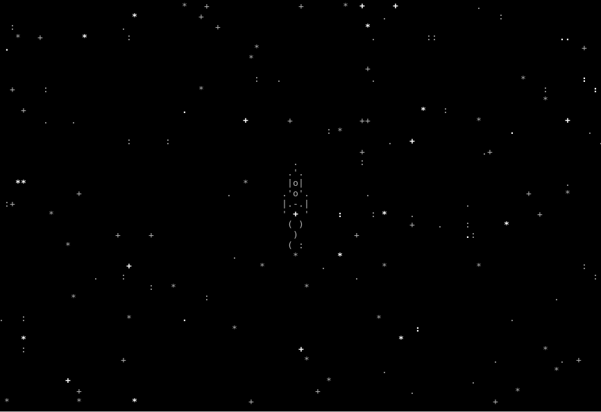

# lesson-1 "Star Rocket"
A simple console game on python curses

 

## Requirements
Python 3.6
This game written on `asyncio` and `curses` - a standart python complectation.

## Run the game
1. Clone the repo.
2. Go to lesson-1 folder in console.
3. Just type `python start.py` in console.

## Gameplay
After run `start.py` script you have curses canvas in your console and rocket at center of it.
You can fly a rocket using the arrow keys.

## Modules
You can design your own animation and then display it on the canvas
The game support "frame animation": rotation of ASCII art frames.
This steps is needed:
1. Create ASCII art frames
2. Put each frame to his own `.txt` file (see by example `txt` files in `animation_frames/animate_spaceship`
3. Put txt files in separate folder in `animations_frames` folder
4. Create **async** function in `animations.py`. See by example `animations.py/animate_spaceship` function.
5. Your animation function must take first argument `canvas` object, and second argument is list of frames and any number of others keywords arguments, as you want.
6. You need function `curses_tools/draw_frame`, which can draw and erase your frame on canvas.
7. Your function must have the same name as the folder that contains the frames of your animation.
8. After all you have to "connect" your animation: just add in `animations.py/FRAME_ANIMATIONS` a tuple. First element of the tuple is name of your animation function, second element is kwargs dictionary (may be empty)
