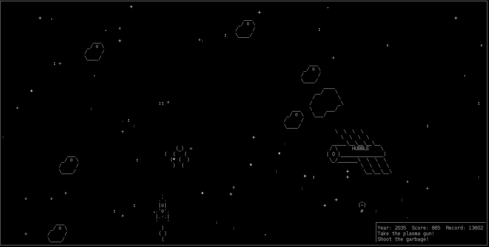

# Lesson 2. "Star Rocket And Space Garbage"
A simple console game on python curses

 

## Requirements
Python 3.6+
This game written on `asyncio` and `curses` - a standart python complectation.  
Sound subsystem on Linux need alsa libraries.  

## Installation
### Linux
1. Clone this repo
2. It is recommended to create your own python virtual environment for the game
3. Install pyalsaaudio: `pip install pyalsaaudio`
4. Install libasound2-dev: `aptitude install libasound2-dev`

### Windows
1. Clone the repo
2. Install python and add interpreter to Windows PATH
3. Install windows curses library: `pip install windows-curses`

## Run the game
1. Go to `lesson-2` folder in console.
2. If you installed a virtual environment, make sure that you are there
3. Just type `python start.py` in console.

## Gameplay
After run `start.py` script you have curses canvas in your console and rocket at center of it.  
You can fly a rocket using the arrow keys.  
After 2020 year your rocket get Space Gun and you can destroy Space Garbage.  
Enjoy!

## Note
This game tested on Debian Jessie and Windows 7.  
